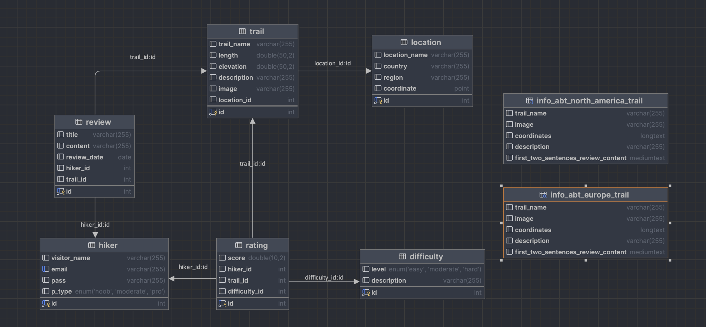

# Hiking-trail-guide-application
## **Structure of the project:**
Here are links to each of the practical assignments where their description and code could be found
* [Introduction](#introduction)
* [Practical assignment 1](#practical-assignment-1)
* [Practical assignment 2](#practical-assignment-2)
* [Practical assignment 3](#practical-assignment-3)
* [Practical assignment 4](#practical-assignment-4)
* [Practical assignment 5](#practical-assignment-5)
* [Diagram and final word](#conclusion)

****

## Introduction
**The topic for my database was Hiking Trail Guide, a simulation of an application that helps hikers find and explore trails around the world. In fact, it was very interesting because I used my knowledge acquired during the course on this database and saw it evolve from creating tables without relationships to creating transactions and views.  To work with the databases, I installed a MySQL server and used port 3306 (by default), and when choosing a client, I had three candidates: DBeaver, Workbench, and Rider, but I chose Rider because, in my subjective opinion, it has a more intuitive interface.**

## ***Practical assignment 1:***
**The main goal of this task was to create and populate tables, use appropriate data types, and perform CRUD(C-create, R-read, U-update, D-delete) operations**
- [x] [schema.sql](pa1/schema.sql)
- This includes creating the `hiking_trail_guide_app` database and filling in tables such as: `location`,`difficulty`,`trail`,`hiker`,`rating`,`review`. I used the following types for the data: `INT`, `VARCHAR`, `DOUBLE`, `DATE`, `ENUM`.

- [x] [quries.sql](pa1/queries.sql)
- writing select queries that include the following clauses : `WHERE`, `GROUP BY`, `HAVING`, `ORDER BY`, `LIMIT`
## ***Practical assignment 2:***
**In this assignment, I learned how to build one-to-one, one-to-many and many-to-many relationships between tables using the junction tables, primary and foreign keys.**
- [x] [schema_updates.sql](pa2/schema_updates.sql)

- Firstly, each table has its own primary key. Second, let's look at the relationships in each of these tables:
  - The `trail` table has one-to-many relationship with the `rating` and `review` tables. 
  - The `location` table has a one-to-many relationship with `trail` table. 
  - `Difficulty` table has a many-to-many relationship with `trail` table (to implement it we use `rating` table which includes pairs of `trail_id` and `difficulty_id` as a junction table). 
  - The `rating` table has three foreign keys: `hiker_id`, `trail_id` and `difficulty_id`. 
  - The `review` table has two foreign keys: `hiker_id` and `trail_id`. 
  - The `hiker` table has a one-to-many relationship with the `rating` and `review` tables.

- [x] [queries.sql](pa2/queries.sql)
- There are two select queries that include many-to-many relationships. To retrieve data based on many-to-many relationship, `JOIN` operations(such as `INNER/LEFT/RIGHT/FULL/CROSS JOIN`,) is typically used. In my case, I leverage `INNER JOIN`.

- [x] [bonus.sql](pa2/bonus.sql)
- To complete this task, I delved into the topic of indices. First, I created two tables, then generated more rows to see the benefits of indexing, which means faster execution time, and indexed a column in one table, which I used in a subsequent query. After executing the query, I found that the query actually became much faster.
## ***Practical assignment 3:***
**This assignment was aimed at improving my hard skills in writing `SELECT`/`UPDATE`/`DELETE` queries with `correlated/non-correlated subqueries`.**
- [x] [subqueries.sql](pa3/pa3.sql)
 - There are 30 queries that include clauses such as : `=` ;`(NOT) IN`; `(NOT)EXISTS`.And for each of these clauses two types of subqueries were demonstrated. 
## ***Practical assignment 4:***
**The task of this assignment was to implement a `stored procedure` with all kinds of parameters (`IN`, `OUT`, `INOUT`) and write transactional mechanism that contains conditions under which `COMMIT` or `ROLLBACK` statements are executed.**
- [x] [procedures.sql](pa4/procedures.sql)
 - Scripts for three stored procedures with parameters IN, OUT, INOUT and transaction are located here¸ Let's  take a closer look at them:
   - The stored procedure with two IN parameters select moderate hiker who give a certain score to a certain trail;
   - The stored procedure with one OUT parameter select amount of hikers who wrote at least two review;
   - The stored procedure with one INOUT parameter select number of trails with a given score that was evaluated by moderate hikers;
   - The transaction follows this logic: user give parameter a by which the score (which is associated with parameter b that represent country) will be decreased. Transaction is not implemented if the score after decreasing is less than 0
- [x] [execution.sql](pa4/executions.sql)
- In this file I called three stored procedures that were described above. Also, I have demonstrated different results of the transaction completion depending on the logic. 

## ***Practical assignment 5:***
**The purpose of this assignment was to create views. Actually, this assignment made me realise that virtual tables are an integral part of working with databases in real life, as they simplify complex queries, ensure data security and make access to this data convenient.**
- [x] [views.sql](pa5/views.sql)
- The structure of the two views is in this file. As a result, I have virtual tables for Europe and North America with columns `trail_name`, `image`, `coordinates`, `description` and `first sentences of the two most recent reviews`. To implement the last column, I used the `SUBSTRING_INDEX` function, which extracts substrings from a string based on a specified delimiter.

## Conclusion:
This course covered the basics of databases and looking at the diagram of my database, I see the result, but at the same time I see a lot of new things to discover and improve and it inspires me to go further!

 ####        ***The project was done by Nechytailenko Anna XM-2***

